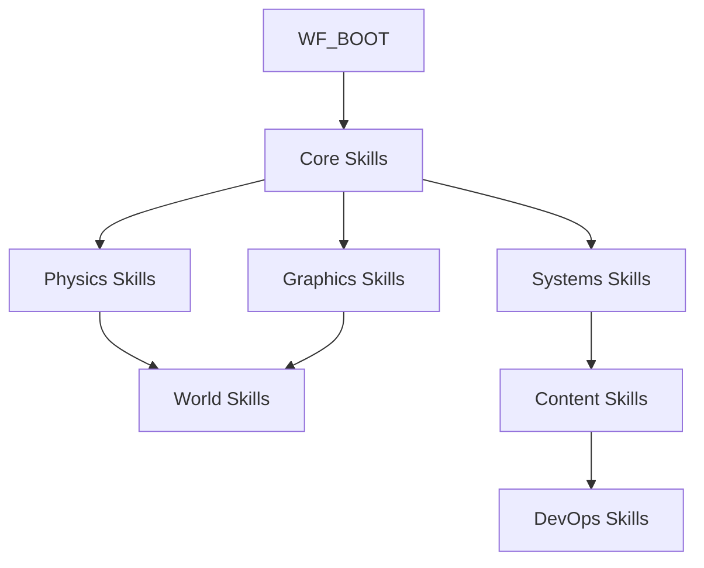

# [T1] CLINE Skills Registry
> **ID**: CLINE_SKILLS_V1.0
> **Role**: Capability Matrix for AI Agent
> **Source**: `../kernel.md`
> **Tier**: 1 (Core)

## 1. SKILL TAXONOMY

| Category | Skills | Protocol Reference |
|----------|--------|-------------------|
| **Core** | Knowledge, Optimize, Refactor, Repair | T3 Protocols |
| **Physics** | Dynamics, Materials, Shapes, World | T3 Protocols |
| **Graphics** | Render, Material, Shader, Post-Process | T3 Protocols |
| **World** | Terrain, Flora, Fauna, Biome, Volumetrics | T3 Protocols |
| **Systems** | State, Input, Event, Persistence | T3 Protocols |
| **Content** | Scene, Content, Composer | T3 Protocols |
| **DevOps** | GitSync, Tooling | Scripts & T3 |

---

## 2. CORE SKILLS

### SKILL: `knowledge-audit`
> **Trigger**: `RUN_KNOWLEDGE`
> **Protocol**: `src/docs/protocols/protocol-knowledge.md`

**Purpose**: Audit documentation hierarchy and sync cross-tier information.

**Prerequisites**:
- Read access to `src/docs/` tree
- `knowledge-graph.md` loaded

**Execution**:
```
1. Tiered traversal T0→T4
2. Verify all linked files exist
3. Check for orphaned protocols
4. Update version IDs on major shifts
5. Prune memory.md to last 10 entries
```

**Output**: Audit report with drift detection.

---

### SKILL: `optimize-performance`
> **Trigger**: `RUN_OPT`
> **Protocol**: `src/docs/protocols/protocol-optimize.md`

**Purpose**: Identify and resolve performance bottlenecks.

**Parameters**:
| Param | Type | Description |
|-------|------|-------------|
| `target` | string | Subsystem to optimize (physics/render/state) |
| `metric` | string | Target metric (fps/memory/gc) |
| `threshold` | number | Improvement target percentage |

**Entry Points**:
- `src/engine/game-loop.service.ts` - Frame timing
- `src/physics/world.service.ts` - Physics step
- `src/services/scene.service.ts` - Render pipeline

---

### SKILL: `refactor-architecture`
> **Trigger**: `RUN_REF`
> **Protocol**: `src/docs/protocols/protocol-refactor.md`

**Purpose**: Clean architectural debt and improve code structure.

**Safeguards**:
- Deprecation Shield: Check `knowledge-graph.md` before deletion
- Zoneless Integrity: No Zone.js introduced
- Signal-State Only: Maintain signal-based state

**Execution**:
```
1. Define refactoring scope
2. Map dependencies via knowledge-graph
3. Create migration path
4. Execute with incremental verification
5. Update fs-manifest.json
```

---

### SKILL: `repair-stability`
> **Trigger**: `RUN_REPAIR`
> **Protocol**: `src/docs/protocols/protocol-repair.md`

**Purpose**: Resolve errors and stability issues.

**Error Domain Mapping**:
| Error Pattern | Domain | Entry Point |
|--------------|--------|-------------|
| `unreachable` | WASM | `src/physics/world.service.ts` |
| `NaN` propagation | Physics | Input validation layer |
| `zone.run` | Architecture | Search & eliminate |

**Logging**:
- Create `src/docs/history/repair-logs/[issue]/`
- Document fix in `mapping.md`

---

## 3. PHYSICS SKILLS

### SKILL: `physics-dynamics`
> **Trigger**: `RUN_PHYS`
> **Protocol**: `src/docs/protocols/protocol-dynamics.md`

**Purpose**: Configure and tune physics simulation.

**Capabilities**:
- Rigid body configuration
- Joint/collider setup
- Gravity manipulation
- Collision filtering

**Constraints**:
- All numeric inputs: `Number.isFinite()` check
- Heightfield dims: `Math.floor()` integers
- Direct RAPIER.World access: PhysicsService only

**Entry Point**: `src/physics/world.service.ts`

---

### SKILL: `physics-materials`
> **Trigger**: Implicit (material config)
> **Protocol**: `src/docs/protocols/protocol-dynamics.md`

**Purpose**: Configure physics material properties.

**Capabilities**:
- Friction coefficients
- Restitution (bounciness)
- Density/mass properties

**Config Source**: `src/config/physics-material.config.ts`

---

### SKILL: `shapes-factory`
> **Trigger**: Entity spawning
> **Protocol**: `src/docs/protocols/protocol-geometry.md`

**Purpose**: Generate collision shapes for entities.

**Shape Types**:
| Shape | Use Case |
|-------|----------|
| Cuboid | Boxes, walls |
| Ball | Spheres, projectiles |
| Capsule | Characters |
| Cylinder | Pillars, barrels |
| ConvexPolyhedron | Complex meshes |
| Heightfield | Terrain |
| Trimesh | Static environment |

**Entry Point**: `src/physics/shapes.factory.ts`

---

## 4. GRAPHICS SKILLS

### SKILL: `pbr-material`
> **Trigger**: `RUN_MAT`
> **Protocol**: `src/docs/protocols/protocol-material.md`

**Purpose**: Create and validate PBR materials.

**Validation Rules**:
```typescript
// Metalness: Binary only
metalness: 0.0 | 1.0  // NO mid-range values

// Roughness thresholds
concrete: roughness > 0.8
metal: roughness < 0.4
```

**Entry Points**:
- `src/services/material.service.ts`
- `src/config/material.config.ts`

---

### SKILL: `render-pipeline`
> **Trigger**: Graphics updates
> **Protocol**: `src/docs/protocols/protocol-render.md`

**Purpose**: Configure Three.js rendering pipeline.

**Capabilities**:
- Scene graph management
- Camera configuration
- Lighting setup
- Shadow rendering

**Entry Point**: `src/services/scene.service.ts` (RESTRICTED access)

---

### SKILL: `post-process`
> **Trigger**: Visual effects
> **Protocol**: `src/docs/protocols/protocol-post-process.md`

**Purpose**: Configure post-processing effects.

**Effects**:
- Bloom
- Ambient Occlusion
- Tone mapping
- Custom shaders

**Config**: `src/config/post-process.config.ts`

---

### SKILL: `shader-authoring`
> **Trigger**: Custom materials
> **Protocol**: `src/docs/protocols/protocol-shader.md`

**Purpose**: Create custom GLSL shaders.

**Capabilities**:
- Vertex shaders
- Fragment shaders
- Uniform management
- Texture sampling

---

## 5. WORLD BUILDING SKILLS

### SKILL: `terrain-generation`
> **Trigger**: `RUN_TERRAIN`
> **Protocol**: `src/docs/protocols/protocol-terrain.md`

**Purpose**: Generate terrain geometry and collision.

**Capabilities**:
- Heightfield generation
- LOD management
- Texture splatting
- Physics mesh synchronization

**Entry Point**: `src/content/algorithms/`

---

### SKILL: `flora-synthesis`
> **Trigger**: `RUN_FLORA`
> **Protocol**: `src/docs/protocols/protocol-flora.md`

**Purpose**: Generate vegetation and botanical elements.

**Capabilities**:
- Procedural plant generation
- Instanced rendering
- Wind simulation
- Seasonal variation

---

### SKILL: `fauna-behavior`
> **Trigger**: `RUN_FAUNA`
> **Protocol**: `src/docs/protocols/protocol-fauna.md`

**Purpose**: Create autonomous agent behaviors.

**Capabilities**:
- Navigation meshes
- Behavior trees
- Flocking/group dynamics
- Predator/prey systems

---

### SKILL: `biome-system`
> **Trigger**: World generation
> **Protocol**: `src/docs/protocols/protocol-biome.md`

**Purpose**: Define biome parameters and transitions.

**Capabilities**:
- Climate zones
- Resource distribution
- Flora/fauna spawning rules
- Atmospheric effects

---

### SKILL: `volumetrics`
> **Trigger**: Atmospheric effects
> **Protocol**: `src/docs/protocols/protocol-volumetrics.md`

**Purpose**: Create volumetric effects.

**Capabilities**:
- Fog/Volumetric fog
- Clouds
- God rays
- Dust/particles

---

## 6. SYSTEMS SKILLS

### SKILL: `state-management`
> **Trigger**: State architecture
> **Protocol**: `src/docs/protocols/protocol-state.md`

**Purpose**: Manage application state using Signals.

**Constraints**:
- NO RxJS for state management
- Signals-only cross-component state
- `effect()` for UI sync only

**Entry Point**: `src/engine/engine-state.service.ts`

---

### SKILL: `input-handling`
> **Trigger**: Control schemes
> **Protocol**: `src/docs/protocols/protocol-input.md`

**Purpose**: Configure input mappings and handlers.

**Capabilities**:
- Keyboard input
- Mouse/touch
- Gamepad support
- Action mappings

**Entry Point**: `src/engine/input-manager.service.ts`

---

### SKILL: `event-system`
> **Trigger**: Communication patterns
> **Protocol**: `src/docs/protocols/protocol-event.md`

**Purpose**: Manage inter-system event communication.

**Capabilities**:
- Event bus
- Pub/sub patterns
- Event prioritization
- Listener management

---

### SKILL: `persistence`
> **Trigger**: Save/load
> **Protocol**: `src/docs/protocols/protocol-persistence.md`

**Purpose**: Handle data serialization and persistence.

**Capabilities**:
- Scene serialization
- Entity state saving
- Config persistence
- Version migration

**Entry Point**: `src/engine/persistence.service.ts`

---

## 7. CONTENT SKILLS

### SKILL: `scene-composition`
> **Trigger**: `NEW_SCENE`
> **Protocol**: `src/docs/protocols/protocol-content.md`

**Purpose**: Create and configure game scenes.

**Capabilities**:
- Scene initialization
- Entity placement
- Lighting setup
- Trigger volumes

---

### SKILL: `asset-generation`
> **Trigger**: `NEW_ASSET`
> **Protocol**: `src/docs/protocols/protocol-content.md`

**Purpose**: Generate procedural assets.

**Capabilities**:
- Mesh generation
- Texture synthesis
- Material creation
- Prefab definition

**Registry**: `src/config/asset-registry.ts`

---

### SKILL: `level-composer`
> **Trigger**: Level building
> **Protocol**: `src/docs/protocols/protocol-composer.md`

**Purpose**: Assemble scenes from modular components.

**Capabilities**:
- Modular piece placement
- Connection rules
- Loot/encounter distribution
- Navigation mesh baking

---

## 8. DEVOPS SKILLS

### SKILL: `git-synchronization`
> **Trigger**: `SYNC_REPO`
> **Protocol**: `src/docs/protocols/protocol-git-sync.md`

**Purpose**: Automate repository synchronization.

**Capabilities**:
- State checking
- Push to target (AxisRotunda/Qualia dev)
- Conflict detection
- Token management

**Script**: `scripts/git-sync.cjs`

**Environment**: Requires `.env` with `GITHUB_TOKEN`

---

### SKILL: `tooling-audit`
> **Trigger**: Tool updates
> **Protocol**: `src/docs/protocols/protocol-tooling.md`

**Purpose**: Manage build tools and dependencies.

**Capabilities**:
- Dependency audit
- Build optimization
- TypeScript configuration
- Linting rules

---

## 9. SKILL INVOCATION MATRIX

| Task | Primary Skill | Secondary Skills |
|------|---------------|------------------|
| Spawn physics object | `physics-dynamics` | `shapes-factory`, `pbr-material` |
| Create new scene | `scene-composition` | `terrain-generation`, `lighting-setup` |
| Fix WASM crash | `repair-stability` | `physics-dynamics` |
| Optimize frame rate | `optimize-performance` | `render-pipeline`, `physics-dynamics` |
| Add UI panel | `ui-architecture` | `state-management` |
| Sync repository | `git-synchronization` | - |

---

## 10. SKILL DEPENDENCY GRAPH



---

*Skills map to Tier 3 Protocols. Always verify prerequisites before invocation.*
