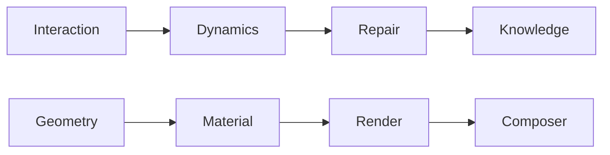

# [T1] Knowledge Adjacency Matrix
> **ID**: K_GRAPH_V2.0
> **Target**: Dependency Resolver.
> **Version**: Machine-Optimized

## 1. System Dependency Matrix
| System | Layer | Primary Dependency | Authority |
|---|---|---|---|
| **Input** | Interaction | `GameInputService` | `protocol-input.md` |
| **Physics** | Engine | `RAPIER.World` | `protocol-dynamics.md` |
| **Render** | Graphics | `THREE.Scene` | `protocol-render.md` |
| **Combat** | Game | `ProjectileStore` | `protocol-combat.md` |
| **LOD** | Graphics | `SpatialGrid` | `protocol-optimize.md` |
| **Terrain** | Data | `TerrainWorker` | `protocol-terrain.md` |

## 2. Protocol Integration Mapping

## 3. File Authority Map (Hotpaths)
*   **Physics Entry**: `src/physics/world.service.ts`
*   **Visual Entry**: `src/services/scene.service.ts`
*   **State Entry**: `src/engine/engine-state.service.ts`
*   **Boot Entry**: `src/engine/bootstrap.service.ts`

## 4. Mutation Constraints
*   **Scalar Only**: No object literals in physics-sync callbacks.
*   **Binary Metal**: PBR Metalness MUST be `0.0` or `1.0`.
*   **WASM Floor**: Dimensions for HF/Trimesh MUST be `Math.floor()`.