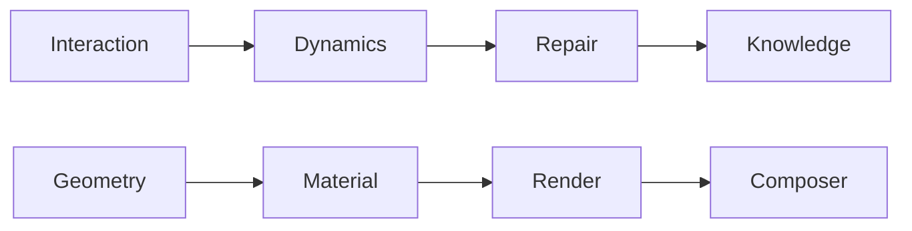

# [T1] Knowledge Adjacency Matrix
> **ID**: K_GRAPH_V2.1
> **Target**: Dependency Resolver.
> **Version**: Machine-Optimized

## 0. CLINE Integration

### CLINE Core Files
| File | Tier | Purpose |
|------|------|---------|
| `.clinerules` | T0 Reference | Constitutional constraints for AI agent |
| `cline-workflows.md` | T1 | Workflow definitions (WF_BOOT, WF_IMPLEMENT, etc.) |
| `cline-skills.md` | T1 | Skill registry mapping protocols to capabilities |
| `.vscode/settings.json` | T1 | VS Code extension configuration for Cline |
| `CLINE_CONFIGURATION.md` | T1 | Configuration guide and troubleshooting |

### MCP Configuration Status
| Component | Status | Notes |
|-----------|--------|-------|
| Filesystem MCP |  **CONFIGURED** | Path set to `C:\Users\epsil\Desktop\Qualia3D\Qualia` |
| Traditional Tools |  Working | `read_file`, `write_file` functional |

**Config Location**: `C:\Users\epsil\AppData\Roaming\Code\User\globalStorage\saoudrizwan.claude-dev\settings\cline_mcp_settings.json`

### CLINE to Protocol Mapping
| CLINE Skill | Protocol | Entry Point |
|-------------|----------|-------------|
| `knowledge-audit` | `protocol-knowledge.md` | Cross-tier documentation sync |
| `optimize-performance` | `protocol-optimize.md` | `game-loop.service.ts` |
| `refactor-architecture` | `protocol-refactor.md` | Architectural cleanup |
| `repair-stability` | `protocol-repair.md` | Error recovery |
| `physics-dynamics` | `protocol-dynamics.md` | `physics/world.service.ts` |
| `pbr-material` | `protocol-material.md` | `services/material.service.ts` |
| `git-synchronization` | `protocol-git-sync.md` | `scripts/git-sync.cjs` |

## 1. System Dependency Matrix
| System | Layer | Primary Dependency | Authority |
|---|---|---|---|
| **Input** | Interaction | `GameInputService` | `protocol-input.md` |
| **Physics** | Engine | `RAPIER.World` | `protocol-dynamics.md` |
| **Render** | Graphics | `THREE.Scene` | `protocol-render.md` |
| **Combat** | Game | `ProjectileStore` | `protocol-combat.md` |
| **LOD** | Graphics | `SpatialGrid` | `protocol-optimize.md` |
| **Terrain** | Data | `TerrainWorker` | `protocol-terrain.md` |

## 2. Protocol Integration Mapping

## 3. File Authority Map (Hotpaths)
*   **Physics Entry**: `src/physics/world.service.ts`
*   **Visual Entry**: `src/services/scene.service.ts`
*   **State Entry**: `src/engine/engine-state.service.ts`
*   **Boot Entry**: `src/engine/bootstrap.service.ts`
*   **CLINE Rules**: `.clinerules` (Project Root)
*   **CLINE Workflows**: `src/docs/core/cline-workflows.md`
*   **CLINE Skills**: `src/docs/core/cline-skills.md`

## 4. Mutation Constraints
*   **Scalar Only**: No object literals in physics-sync callbacks.
*   **Binary Metal**: PBR Metalness MUST be `0.0` or `1.0`.
*   **WASM Floor**: Dimensions for HF/Trimesh MUST be `Math.floor()`.