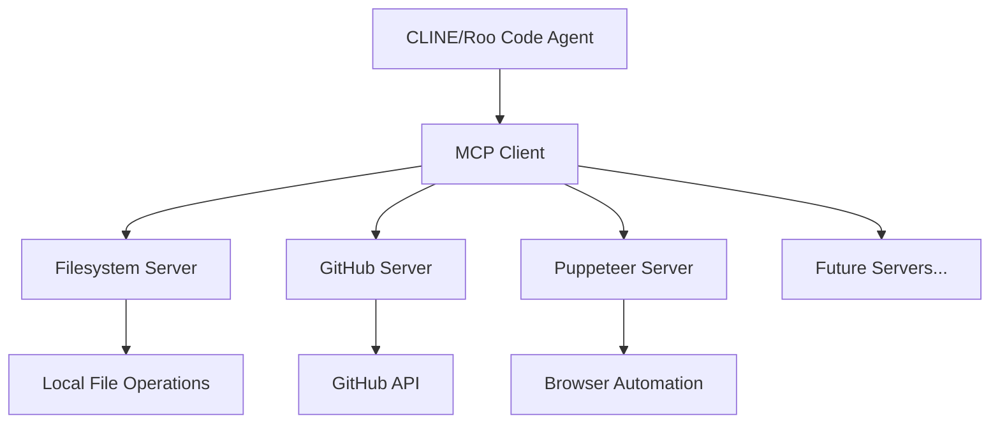

# [T1] MCP Server Registry
> **Scope**: Model Context Protocol server catalog and configuration
> **Source**: `src/docs/kernel.md`
> **Audience**: AI Agents + Developers
> **Version**: 1.0.0

---

## 1. REGISTRY OVERVIEW

### 1.1 What is MCP?
Model Context Protocol (MCP) is an open standard for AI agent tool integration. MCP servers provide specialized capabilities that extend AI agent functionality beyond built-in tools.

### 1.2 Qualia3D MCP Architecture


---

## 2. ACTIVE SERVERS

### 2.1 Filesystem MCP (REQUIRED)
**Package**: `@modelcontextprotocol/server-filesystem`
**Purpose**: Local file system operations
**Cost**: ✅ FREE (unlimited local use)
**Status**: ⚠️ **MISCONFIGURED** - Requires immediate fix

**Configuration:**
```json
{
  "mcpServers": {
    "filesystem": {
      "command": "npx",
      "args": [
        "-y",
        "@modelcontextprotocol/server-filesystem",
        "C:\\Users\\epsil\\Desktop\\Qualia3D\\Qualia"
      ],
      "disabled": false
    }
  }
}
```

**Capabilities:**
| Tool | Description | Use Case |
|------|-------------|----------|
| `read_file` | Read file contents | Code analysis |
| `write_file` | Write/overwrite files | Code generation |
| `list_directory` | List directory contents | Discovery |
| `directory_tree` | Recursive tree view | Project mapping |
| `search_files` | Regex search across files | Find patterns |
| `move_file` | Move/rename files | Refactoring |
| `get_file_info` | File metadata | Validation |

**⚠️ CRITICAL FIX REQUIRED:**
Current path points to wrong directory. Update to:
```
C:\Users\epsil\Desktop\Qualia3D\Qualia
```

---

### 2.2 GitHub MCP (RECOMMENDED)
**Package**: `@modelcontextprotocol/server-github`
**Purpose**: GitHub API integration
**Cost**: ✅ FREE for public repos (unlimited read)
**Status**: Ready to enable

**Configuration:**
```json
{
  "mcpServers": {
    "github": {
      "command": "npx",
      "args": [
        "-y",
        "@modelcontextprotocol/server-github"
      ],
      "env": {
        "GITHUB_PERSONAL_ACCESS_TOKEN": "${env:GITHUB_TOKEN}"
      },
      "disabled": false
    }
  }
}
```

**Capabilities:**
| Tool | Description | Use Case |
|------|-------------|----------|
| `search_repositories` | Find repos on GitHub | Research |
| `get_file_contents` | Read repo files | Documentation |
| `create_issue` | Create GitHub issues | Bug tracking |
| `create_pull_request` | Open PRs | Contributions |
| `fork_repository` | Fork repos | External code |
| `list_commits` | View commit history | Audit |

**Setup Requirements:**
1. Generate token at https://github.com/settings/tokens
2. Add to `.env`: `GITHUB_TOKEN=ghp_xxxxxxxx`
3. Enable MCP server in CLINE settings

---

### 2.3 Puppeteer MCP (OPTIONAL)
**Package**: `@modelcontextprotocol/server-puppeteer`
**Purpose**: Browser automation
**Cost**: ✅ FREE (local Chromium)
**Status**: Disabled by default

**Configuration:**
```json
{
  "mcpServers": {
    "puppeteer": {
      "command": "npx",
      "args": [
        "-y",
        "@modelcontextprotocol/server-puppeteer"
      ],
      "disabled": true
    }
  }
}
```

**Capabilities:**
| Tool | Description | Use Case |
|------|-------------|----------|
| `puppeteer_navigate` | Navigate to URL | Testing |
| `puppeteer_screenshot` | Capture screenshots | Visual testing |
| `puppeteer_click` | Click elements | UI testing |
| `puppeteer_fill` | Fill form inputs | Form testing |
| `puppeteer_evaluate` | Execute JavaScript | Custom checks |

**Use Cases for Qualia3D:**
- Automated screenshot testing of 3D scenes
- Visual regression testing
- UI interaction validation

---

## 3. CANDIDATE SERVERS (Under Evaluation)

### 3.1 Sequential Thinking (POTENTIAL)
**Package**: `@modelcontextprotocol/server-sequential-thinking`
**Purpose**: Structured problem-solving
**Cost**: ✅ FREE
**Status**: Under evaluation

**Value for Qualia3D:**
- Complex physics debugging
- Architecture decision analysis
- Multi-step refactoring planning

### 3.2 Memory/Knowledge Graph (POTENTIAL)
**Package**: Custom or `@modelcontextprotocol/server-memory`
**Purpose**: Persistent knowledge storage
**Cost**: ✅ FREE (local)
**Status**: Under evaluation

**Value for Qualia3D:**
- Supplement existing `src/docs/history/` system
- Cross-session context retention
- Enhanced entity relationship tracking

---

## 4. REJECTED SERVERS (Paid/Capped)

### 4.1 Perplexity MCP
**Reason**: Search API has usage limits
**Cost**: $5/month for 500 requests
**Verdict**: ❌ Not suitable - web_search tool available

### 4.2 Brave Search MCP
**Reason**: Requires API key with limits
**Cost**: Free tier: 2000 requests/month
**Verdict**: ⚠️ Optional if web_search insufficient

### 4.3 Any Cloud-Hosted MCP
**Reason**: Require API keys, quotas, subscriptions
**Verdict**: ❌ Avoid - prefer local/self-hosted

---

## 5. INSTALLATION GUIDE

### 5.1 Automatic Installation (Recommended)
Run the universal setup script:
```powershell
node scripts/mcp-setup-universal.js
```

This script will:
1. **Auto-detect** Cline vs Roo Code extension
2. Locate correct settings directory for detected extension
3. Backup existing configuration
4. Apply Qualia3D MCP configuration
5. Validate paths and tokens

**Note:** The old `mcp-setup.js` script has been superseded by `mcp-setup-universal.js` which supports both Cline and Roo Code extensions.

### 5.2 Manual Installation

**Step 1**: Open CLINE MCP Settings
```
Ctrl+Shift+P → "Cline: MCP Settings"
```

**Step 2**: Edit settings.json
Paste the configuration from Section 2.1 or 2.2

**Step 3**: Restart VS Code
```
Ctrl+Shift+P → "Developer: Reload Window"
```

**Step 4**: Verify Installation
```
Look for green indicators next to MCP servers in CLINE panel
```

---

## 6. CONFIGURATION REFERENCE

### 6.1 Full MCP Configuration
Location: `%APPDATA%/Code/User/globalStorage/saoudrizwan.claude-dev/settings/cline_mcp_settings.json`

```json
{
  "mcpServers": {
    "filesystem": {
      "command": "npx",
      "args": [
        "-y",
        "@modelcontextprotocol/server-filesystem",
        "C:\\Users\\epsil\\Desktop\\Qualia3D\\Qualia"
      ],
      "disabled": false
    },
    "github": {
      "command": "npx",
      "args": [
        "-y",
        "@modelcontextprotocol/server-github"
      ],
      "env": {
        "GITHUB_PERSONAL_ACCESS_TOKEN": "${env:GITHUB_TOKEN}"
      },
      "disabled": false
    },
    "puppeteer": {
      "command": "npx",
      "args": [
        "-y",
        "@modelcontextprotocol/server-puppeteer"
      ],
      "disabled": true
    }
  }
}
```

### 6.2 Environment Variables Required
| Variable | Source | Required For |
|----------|--------|--------------|
| `GITHUB_TOKEN` | GitHub Settings > Tokens | GitHub MCP |

### 6.3 Path Variables
| Variable | Value | Usage |
|----------|-------|-------|
| `APPDATA` | `C:\Users\epsil\AppData\Roaming` | CLINE settings location |
| `PROJECT_ROOT` | `C:\Users\epsil\Desktop\Qualia3D\Qualia` | Filesystem MCP scope |

---

## 7. TROUBLESHOOTING

### 7.1 MCP Server Not Starting
**Symptom**: Red indicator in CLINE panel
**Solutions:**
```powershell
# 1. Verify npx is available
npx --version

# 2. Check Node.js path in VS Code
# Settings > Terminal > Integrated > Env: Windows

# 3. Manually test server
npx -y @modelcontextprotocol/server-filesystem C:\Users\epsil\Desktop\Qualia3D\Qualia
```

### 7.2 Filesystem Access Denied
**Symptom**: "Access denied - path outside allowed directories"
**Solution**: Update allowed directories in MCP configuration (see 2.1)

### 7.3 GitHub Authentication Failed
**Symptom**: GitHub MCP returns 401 errors
**Solutions:**
1. Verify `GITHUB_TOKEN` in `.env`
2. Check token has `repo` scope
3. Regenerate token if expired

### 7.4 Puppeteer Chromium Download
**Symptom**: First run downloads Chromium
**Note**: This is normal (~100MB download)

---

## 8. SECURITY CONSIDERATIONS

### 8.1 Filesystem MCP Scope
- ✅ Only accesses `Qualia3D\Qualia` directory
- ✅ Cannot escape project sandbox
- ✅ Read/Write within project only

### 8.2 GitHub Token Scope
- Minimum required: `repo` (for private repos)
- Public repos only: No token needed for read
- Never commit token to git (`.env` is in `.gitignore`)

### 8.3 Network Access
| Server | Network | Risk Level |
|--------|---------|------------|
| Filesystem | Local only | 🟢 Minimal |
| GitHub | GitHub API | 🟢 Low (HTTPS) |
| Puppeteer | Local browser | 🟢 Minimal |

---

## 9. USAGE IN QUALIA3D

### 9.1 Agent Workflows Using MCP

**WF_BOOT with MCP:**
```json
{
  "step": 5,
  "name": "Check FS Manifest",
  "action": "mcp_read_file",
  "target": "src/docs/core/fs-manifest.json"
}
```

**WF_SYNC with MCP:**
```json
{
  "step": 8,
  "name": "Create GitHub Issue",
  "action": "mcp_github_create_issue",
  "condition": "If sync failed"
}
```

### 9.2 Traditional Tools vs MCP
| Operation | Traditional | MCP |
|-----------|-------------|-----|
| Read file | `read_file` tool | `filesystem.read_file` |
| Write file | `write_file` tool | `filesystem.write_file` |
| List directory | `list_files` tool | `filesystem.list_directory` |
| Search files | `search_files` tool | `filesystem.search_files` |
| GitHub operations | N/A | `github.*` |

**Recommendation**: Prefer MCP when available for consistency. Fallback to traditional tools.

---

## 10. RELATED DOCUMENTATION

| Document | Purpose |
|----------|---------|
| [Development Environment](./development-environment.md) | Full setup guide |
| [CLINE Configuration](./CLINE_CONFIGURATION.md) | CLINE-specific settings |
| [Knowledge Graph](./knowledge-graph.md) | System dependencies |
| [Protocol Tooling](../protocols/protocol-tooling.md) | Tool management |

---

*MCP servers extend agent capabilities while maintaining security boundaries. This registry is maintained in `fs-manifest.json`.*