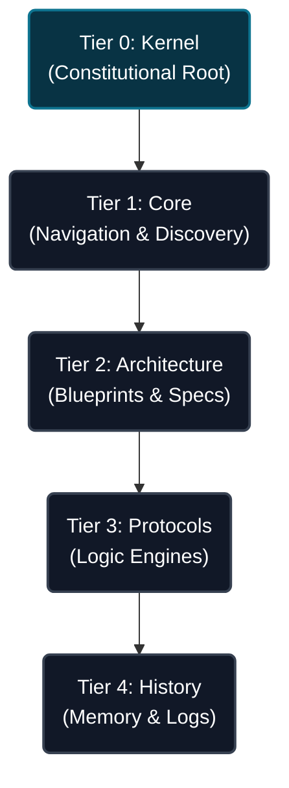

# Project Hierarchy
> **Scope**: File System Map.
> **Audience**: AI Agents (Discovery).
> **Version**: 3.1 (Manifest Sync)

## 1. Documentation Tree (`src/docs/`)

### 1.1 Documentation Tiers Visualized

The documentation is organized into a strict hierarchy to manage dependencies and ensure a logical discovery path for agents.



### 1.2 File System Map

```text
docs/
├── kernel.md                       # [Tier 0] Constitutional Root
├── core/                           # [Tier 1] Navigation & Discovery
│   ├── systems.md                  # Logic Map & Priorities
│   ├── commands.md                 # Operational Registry
│   ├── migration-manifest.md       # Structural Integrity Tracker
│   ├── fs-manifest.json            # [NEW] File System Operations
│   ├── project-hierarchy.md        # This file (Nav Map)
│   ├── knowledge-graph.md          # Adjacency Matrix
│   ├── system-instructions.md      # [MOVED] Operational Directives
│   └── agent-workflow.md           # Operational Instructions
├── architecture/                   # [Tier 2] Blueprints & Specs
│   ├── ecs.md                      # SoA & Component logic
│   ├── graphics.md                 # Pipeline & Rendering
│   ├── physics.md                  # WASM & Materials
│   └── ...                         # Specifications
├── protocols/                      # [Tier 3] Logic Engines
│   ├── protocol-knowledge.md       # Tier Governance
│   ├── protocol-optimize.md        # Perf & GC
│   ├── protocol-refactor.md        # Arch cleanup
│   └── ...                         # Domain protocols
└── history/                        # [Tier 4] Memory & Logs
    ├── memory.md                   # Context Stream
    └── fragments/                  # History archives
```

## 2. Source Tree (`src/`)
```text
src/
├── app.component.ts                # [Entry] Root Component
├── components/                     # [UI] UI View Layer
├── config/                         # [Data] PBR & Physics Configs
├── content/                        # [Level] Algorithms & Scenes
├── data/                           # [Data] Static ECS Templates
├── engine/                         # [Core] Framework-Agnostic Logic
├── physics/                        # [Core] Rapier3D Integration
└── services/                       # [Glue] Facades & Assemblees
```